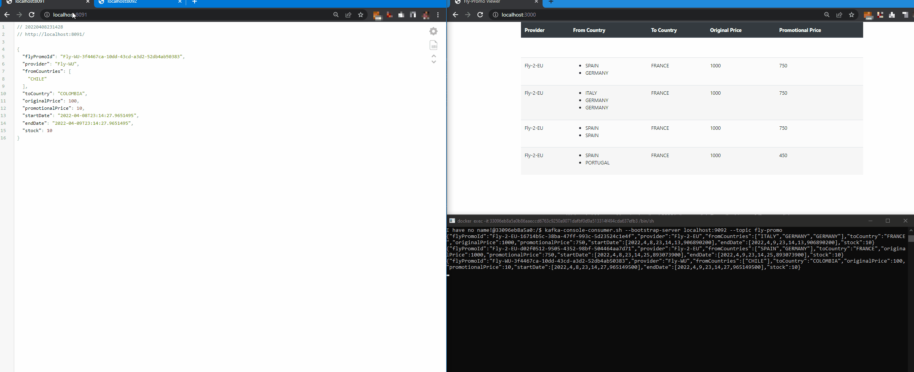

# POC Fly promo with Kafka

This is a POC for understand Kafka implementation with springboot and organize a project with submodules where:

- fly-promo-kafka-model: Is the model classes use on Kafka
- fly-promo-kafka-spring-core: Is the common spring configurations that are needed to use by the spring apps
- fly-promo-publisher-flyWU: Simulate a fly-promo provider called "Fly With Us" that will inform to Kafka the new promotions
- fly-promo-publisher-fly2EU: (in **Kotlin**) Simulate a fly-promo provider called "Fly To Europe" that will inform to Kafka the new promotions
- fly-promo-tracking-consumer: General consumer that will bring a websocket after listen the kafka topic of fly-promo
- fly-promo-preview-page: **vert.x** httpserver use for bring the static resources, in this case a webpage that connect to the websocket



## App endpoints and ports by default

**fly-promo-preview-page**

- Webpage accessible on localhost:3000

**fly-promo-tracking-consumer**

- GET localhost:8090/fly-promo-list: Use for generate new FlyPromo

- Websocket MessageMapping localhost:8090/init-promo-list: Force the trigger of /fly-promo-list
- Websocket localhost:8090/fly-promo-list: Return all FlyPromos
- Websocket localhost:8090/fly-promo: Return new FlyPromo

**fly-promo-publisher-flyWU**

- GET localhost:8091: Use for generate new FlyPromo

**fly-promo-publisher-fly2EU**

- GET localhost:8092: Use for generate new FlyPromo

----

## How to start the environment

### Initialize Zookeeper and Kafka
To make easy the deployment we will use images from bitnami, only need to execute ```docker-compose up``` and this will provide kafka on port 9092 and zookeeper in 2128

### Initialize the Apps

#### From IDE
You only need to run the main classes from publishers/consumers

#### From Jars
If you create the jars with ```mvn clean package``` and want to execute the applications you will need to provide in the same level of the jar a folder called
```config``` with an application.yml with the property kafka.bootstrapAddress or execute the jar with the flag ```--kafka.bootstrapAddress="{yourHost:port}"```
note that the property is not needed for the fly-promo-preview-page

----

## How to interact with kafka


### Creating topics

For make work the POC you will need to create Topics, this can be achieved in two ways

#### Can be created from the code

In your application (consumer/producer) can be created using the @EnableKafkaTopics annotation

#### Can be created manually

Enter to the kafka container and execute 

kafka-topics.sh --create --bootstrap-server localhost:9092 --replication-factor 1 --partitions 1 --topic "test"
kafka-topics.sh --create --bootstrap-server localhost:9092 --replication-factor 1 --partitions 1 --topic "fly-promo"

### List topics

Enter to the kafka container and execute

kafka-topics.sh --bootstrap-server=localhost:9092 --list

### Connect to topic using the console consumer from kafka
Enter to the kafka container and execute

kafka-console-consumer.sh --bootstrap-server localhost:9092 --topic fly-promo --from-beginning
